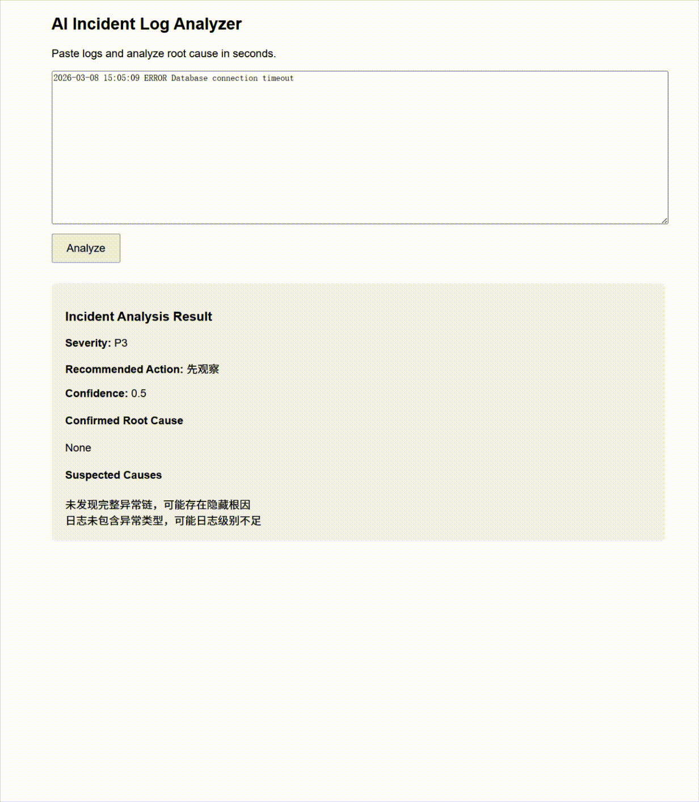

# Incident Community - AI 事故分析报告引擎（开源版）

🚨 Loki 日志 2 分钟部署完成 → 自动生成结构化事故报告  
支持企业微信、钉钉、飞书推送 | 多AI模型（DeepSeek / 通义千问 / Grok / Ollama本地等）

**开源版免费自用** | **商业版提供完整AI根因分析 + 告警集成 + 技术支持**

## 🚀 支持阿里云计算巢一键私有化部署（推荐企业用户）

无需自己管理ECS，只需在计算巢填写以下参数即可完成部署：

- Loki / Prometheus 地址
- 企业微信（或钉钉/飞书）Webhook
- AI模型选择（Qwen / DeepSeek 等）及对应 API Key
- 其他通知渠道配置

部署完成后，引擎自动连接您的现有监控环境，实现：
- 从 Loki 拉取异常日志
- AI 智能根因分析（已确认根因、疑似问题、置信度）
- 生成结构化事故报告
- 一键推送至企业微信 / 钉钉 / 飞书 / 邮件 / 短信

**完全私有化**：所有日志和数据留在您自己的阿里云账号内。

# Incident Community

🚨 Automatic Incident Report Generator for DevOps
AI SRE Incident Analysis Engine
When production errors happen,  
generate a structured incident report in seconds.

Stop reading thousands of log lines.
Let the system summarize the incident for you.

🌐 Live Demo (read-only example)
http://116.233.96.74:33025/index.html

## Demo

📄 Automatic Postmortem Report
Incident Community automatically generates
a postmortem-style report including:

• Timeline
• Root cause hypothesis
• Key evidence
• Impact scope
• Suggested actions

👥 Who should use this?

• DevOps engineers
• SRE teams
• Backend developers
• Small teams without full observability platforms

🚑 Incident Community 是一个轻量级日志分析工具，帮助开发者快速定位系统异常并生成结构化事故报告。

  
  
  
  

⸻

🚀 为什么要做这个项目？

在真实生产环境中，很多团队都会遇到同一个问题：
	•	系统出事故后，需要花 大量时间翻日志
	•	事故复盘通常 依赖人工整理
	•	日志信息杂乱，很难快速定位根因
	•	事故报告写起来 费时费力

Incident Community 的目标就是解决这些问题。

上传日志 → 自动分析 → 生成结构化事故报告。

⸻

✨ 核心功能

📤 日志上传分析

支持两种方式：
	•	文件上传
	•	文本日志输入

⸻

🔍 自动异常识别

基于规则引擎自动识别：
	•	Exception
	•	Error
	•	Timeout
	•	Database errors
	•	服务调用失败

并生成分析结果。

⸻

📊 结构化事故报告

系统自动生成完整事故分析报告，包括：
	•	事故概述
	•	异常日志
	•	根因分析
	•	影响范围
	•	修复建议

⸻

💾 多格式导出

支持下载报告：
	•	Markdown
	•	HTML
	•	PDF

方便：
	•	内部复盘
	•	技术博客
	•	团队知识沉淀

⸻

📸 示例报告

生成的 Markdown 报告示例：

# Incident Report

## Incident Summary
Service: payment-service  
Environment: production

## Root Cause
Database connection timeout caused service failure.

## Impact
Payment requests failed for 3 minutes.

## Recommendation
Increase database connection pool size.

⸻

🏗️ 项目架构

项目采用 分层架构设计：

incident-community
│
├── incident-api
│   REST API 接口层
│
├── incident-core
│   核心业务逻辑
│
├── incident-infrastructure
│   基础设施层
│
└── incident-rule-engine
    日志规则分析引擎

技术栈：

技术	说明
Spring Boot	后端框架
PostgreSQL	数据库
Maven	构建工具
Thymeleaf	模板引擎
OpenHTMLToPDF	PDF 生成

⸻

⚡ 快速开始

环境要求
	•	Java 21+
	•	PostgreSQL 17+
	•	Maven 3.6+

⸻

1️⃣ 克隆项目

git clone https://github.com/LukeGitHub-xd/incident-community.git
cd incident-community

⸻

2️⃣ 创建数据库

CREATE DATABASE incident_db;

⸻

3️⃣ 修改配置

编辑：

incident-api/src/main/resources/application.yml

spring:
  datasource:
    url: jdbc:postgresql://localhost:5432/incident_db
    username: postgres
    password: your_password

⸻

4️⃣ 启动服务

mvn clean package -DskipTests

java -jar incident-api/target/incident-api-1.0.0.jar

⸻

5️⃣ 访问 API

http://localhost:8080/api

⸻

📖 API 示例

上传日志文件

curl -X POST http://localhost:8080/api/incidents/upload \
  -F "file=@error.log" \
  -F "serviceName=my-service" \
  -F "env=production"

⸻

文本日志分析

curl -X POST "http://localhost:8080/api/incidents/analyze-text?log=ERROR...&serviceName=test&env=dev"

⸻

获取分析结果

curl http://localhost:8080/api/incidents/{incidentId}/insight

⸻

下载报告

Markdown

curl http://localhost:8080/api/incidents/{id}/report/file -o report.md

HTML

curl http://localhost:8080/api/incidents/{id}/report.html -o report.html

PDF

curl http://localhost:8080/api/incidents/{id}/report.pdf -o report.pdf

⸻

🆚 开源版 vs 商业版

| 功能 | 开源版 | 商业版 |
|------|--------|--------|
| 日志上传 | ✅ | ✅ |
| 基础分析 | ✅ | ✅ |
| Markdown 报告 | ✅ | ✅ |
| HTML/PDF导出 | ✅ | ✅ |
| AI 智能分析 | ❌ | ✅ |
| 告警集成 | ❌ | ✅ |
| 自定义策略 | ❌ | ✅ |
| 技术支持 | 社区 | 专业团队 |

⸻

🤝 贡献

欢迎贡献代码：
	1.	Fork 项目
	2.	创建 Feature Branch
	3.	提交 PR

⸻

📄 License

MIT License

⸻

⭐ Star History

如果这个项目对你有帮助，欢迎给一个 Star ⭐

你的支持会让项目持续发展。

⸻

📮 联系方式

GitHub：

https://github.com/LukeGitHub-xd/incident-community

Issue：

https://github.com/LukeGitHub-xd/incident-community/issues

⸻

🎯 未来规划
	•	AI Root Cause Analysis
	•	LLM 自动事故复盘
	•	Kubernetes 日志集成
	•	告警系统集成
	
